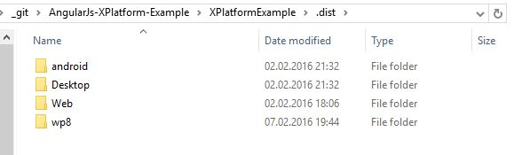
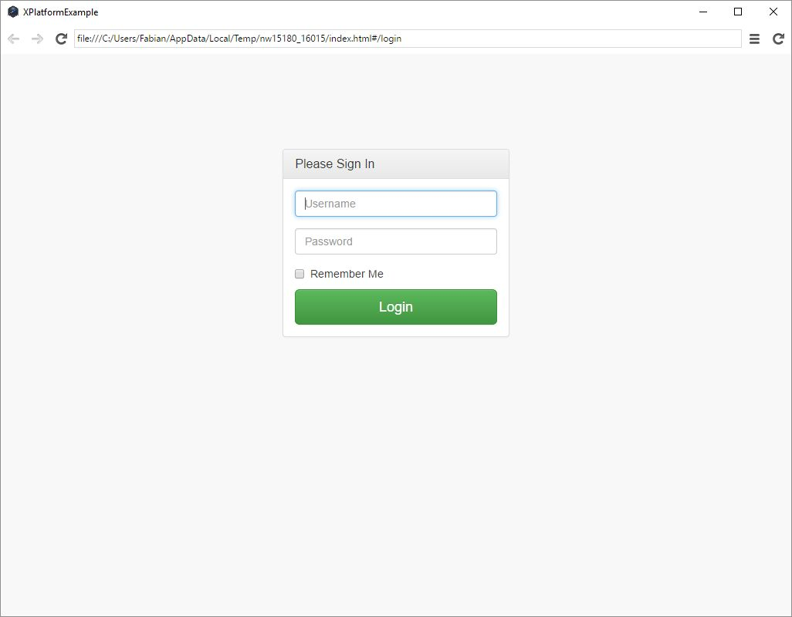
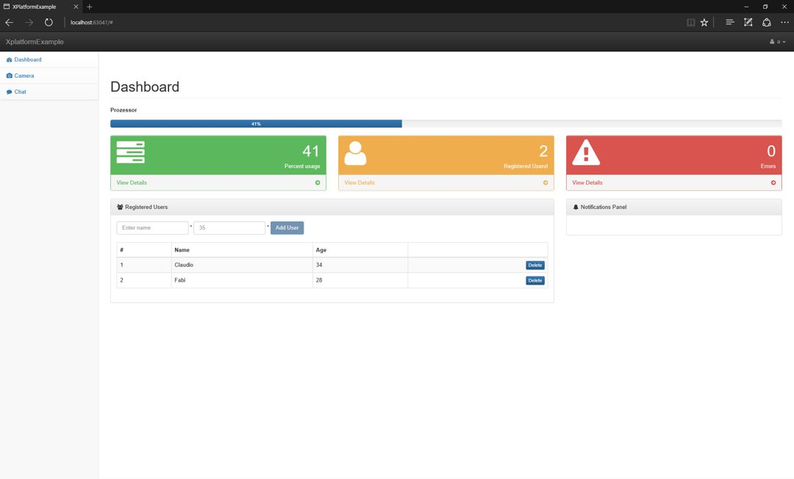
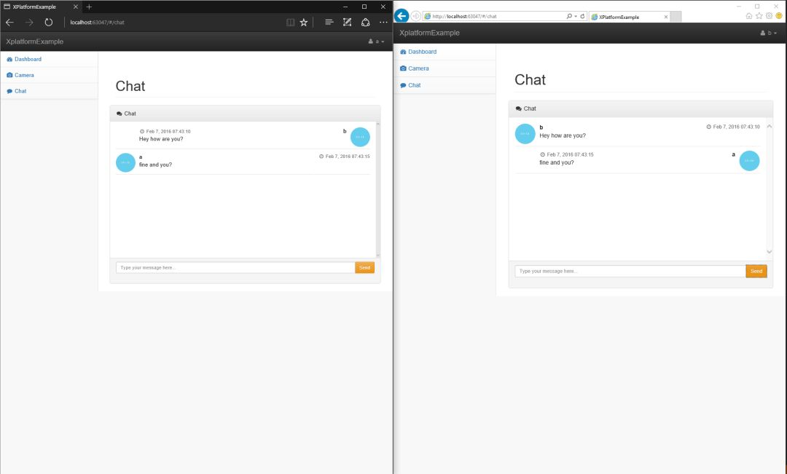
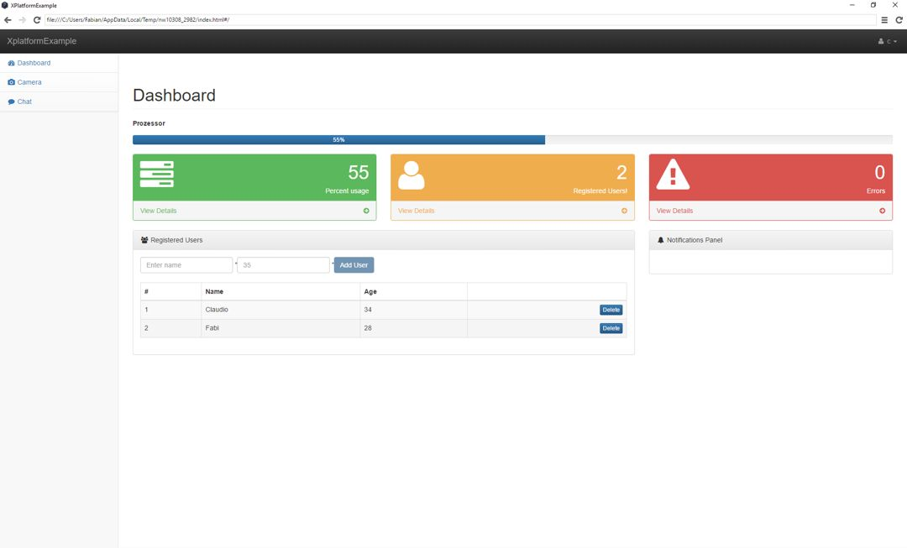
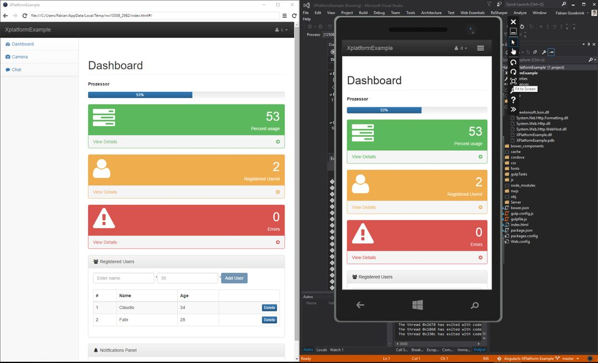

# AngularJs and ASP.NET WebAPI XPlatform-Example with SignalR

An example of an AngularJs-Application turning into a (real) X-Platform-Application using Gulp as Taskrunner, bower, npm, ASP.NET WEBAPI with SignalR and gulp.

##### If you have problems in "web-createHtmlTemplates" navaigate to the "node_modules\gulp-header"-Folder and run "npm install" in this folder explicitly. This shall fix the issue.
##### From here  <a href="https://github.com/Semantic-Org/Semantic-UI/issues/3554"> Gulp build fail #3554 </a> 

### Special Thanks to the Boardz!-Example from Thinktecture <a href="https://github.com/thinktecture/boardz-cross-platform-sample">Sample application for various “Cross-Platform HTML5 – in Action!” workshops</a> 

You can clone this repo and run <pre>npm install</pre> <pre>bower install</pre>

After this you can run <pre>gulp prod:build:all</pre> to build all in a ".dist" folder.

The final distribution-folder (I do not have a Mac to build for IOS)

The desktop version

The web version

The chat in the web (SignalR)

The application in the desktop version

The mobile app (Windows Phone)

Regards

Fabian
